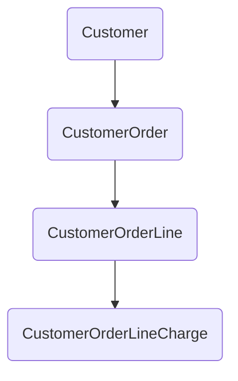

# API Documentation
## Endpoints
1. [`/foundation/crudHandler`](#dailyshiftteamgetbyday)

### DailyShiftTeam/getByDay

* endpoint: `dailyShiftTeams/getByDay`
* payload: 
```json
{
  "current_date": "2020-08-25",
	"team_id": "1",
  "shift_id": "2"
}
```

